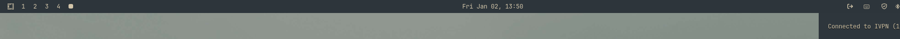
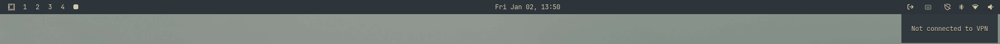

# Waybar VPN Module

A Waybar custom module to display VPN connection status.





## Features

- Displays VPN connection status with Nerd Font icons
- Shows VPN name and IP in tooltip
- Click to disconnect VPN
- Support for multiple VPN clients (IVPN, NordVPN)

## Installation

1. Ensure Go is installed
2. Clone or download this repository
3. Build the binary: `go build -o waybar-vpn .`
4. Place the binary in your PATH

## Usage

### Status Display
Run without arguments it shows JSON output:

```bash
./waybar-vpn
# Output: {"text":"","tooltip":"Not connected to VPN","class":"disconnected"}
```

### Disconnect
```bash
./waybar-vpn --action=disconnect
# Output: Disconnected successfully
```

### Options
- `--client`: VPN client (ivpn, nordvpn; default: ivpn)
- `--action`: status or disconnect (default: status)
- `--icon-connected`: Icon for connected state (default: )
- `--icon-disconnected`: Icon for disconnected state (default: )
- `--tooltip-format`: Tooltip format with {name} and {ip} placeholders (default: "Connected to {name} ({ip})")

## Waybar Configuration

Add to your `~/.config/waybar/config`:

```json
"custom/vpn": {
    "exec": "waybar-vpn",
    "interval": 5,
    "return-type": "json",
    "format": " {text}",
    "on-click": "waybar-vpn --action=disconnect"
  }
```

## Requirements

- VPN client CLI installed (e.g., `ivpn` for IVPN, `nordvpn` for NordVPN)
- Waybar

